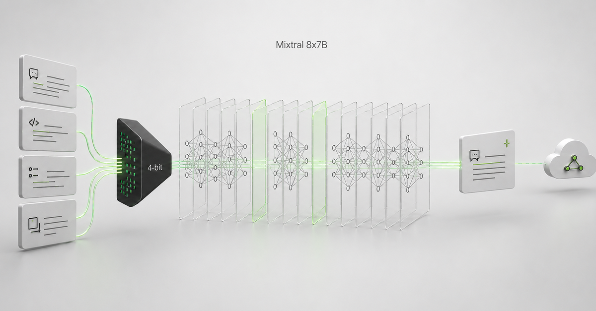

# Mixtral-8x7B · QLoRA Fine-Tuning

Fine-tuning a 47-billion-parameter mixture-of-experts model on a single GPU, and
serving it — the training run, the deployment, and a working inference console
in one repository.



<p align="left">
  
  
  
  
</p>

---

## What this is

Mixtral-8x7B has roughly 47B parameters. In BF16 that is about 94 GB of weights —
more than any single accessible GPU holds. This project loads it in **4-bit NF4**,
freezes it, and trains **LoRA adapters** over the frozen base, which puts the run
on one GPU and leaves roughly **3.96%** of parameters trainable.

The result is deployed to a SageMaker endpoint behind Lambda and API Gateway, and
this repository's web application calls it.

Two things are deliberately separate throughout, because conflating them is the
most common way an ML demo misleads:

```
Development lifecycle   Dolly 15K → Mixtral-8x7B → 4-bit NF4 → QLoRA → Adapter → Deployment
      (historical)

Runtime request path    Browser → /api/inference → API Gateway → Lambda → SageMaker → Response
      (per request)
```

A user's request does not pass through training. Only the runtime path animates
in the UI.

## Training

| | |
|---|---|
| Base model | Mixtral-8x7B-v0.1 (sparse MoE, 8 experts) |
| Dataset | Databricks Dolly 15K (`databricks/databricks-dolly-15k`) |
| Quantization | 4-bit NF4 |
| Compute dtype | BF16 |
| Gradient checkpointing | Enabled |
| LoRA rank / alpha | 64 / 16 |
| Trainable parameters | ~3.96% |
| Epochs | 2 |
| Batch size | 2 |
| Learning rate | 2e-4 |

Run on a SageMaker managed training job. The console reported the job
**Completed in approximately 7 hours**, and the CloudWatch log ends at
**1528/1528 steps** with the training toolkit reporting `SUCCESS`.

The notebooks and the training entry point are in [`training/`](training/), with
account-specific identifiers replaced by documented placeholders.

### On the numbers

Every figure above is either a configuration value or a reading taken from the
AWS console. There is **no** accuracy score, benchmark result, base-model
comparison, throughput figure, GPU-utilization metric, or cost saving anywhere in
this repository, because none was measured. Values that were never recorded stay
`null` in [`data/model.ts`](data/model.ts) and render as "Not recorded" rather
than being filled with something plausible.

Round-trip latency is the one measurement the app makes: it is timed end to end,
server-side, for a real request, and is labeled as a total. Individual hops are
not timed, and the request-path animation shows topology and progress only.

## Serving

```
Browser  →  Next.js /api/inference  →  API Gateway  →  Lambda  →  SageMaker Endpoint
                    (server)                                       fine-tuned Mixtral
```

The browser never learns where the model lives. `MIXTRAL_API_URL` and
`MIXTRAL_API_KEY` are read only inside route handlers, in a single module, and
the only endpoints exposed to the client are `/api/inference` and `/api/health`.
[`tests/architecture/boundaries.test.ts`](tests/architecture/boundaries.test.ts)
fails the build if a component, page, or hook so much as references them.

The deployed Lambda fixes generation settings server-side, so the app sends
`{ prompt }` alone and shows the parameters as read-only. Setting
`MIXTRAL_SUPPORTS_PARAMETERS=true` enables sending them, with no code change,
against a handler that accepts them.

### Endpoint status is never guessed

`GET /api/health` inspects configuration and **never contacts AWS**, because a
reachability check costs a real model invocation. So the app distinguishes
`configured` (environment is set, nothing contacted) from `reachable`, and the
latter is earned only by an explicit probe or a completed run. It never displays
"LIVE", and it never attributes a slow first request to a cold start it cannot
observe.

## Running it

```bash
cp .env.example .env.local     # set MIXTRAL_API_URL
npm install
npm run dev                    # http://localhost:3000
```

```bash
npm test          # 158 tests
npm run build
```

The app runs without an endpoint configured — it reports `not_configured` and
declines to invoke, rather than failing at startup.

## Deploying

[`render.yaml`](render.yaml) is a Render blueprint: **New → Blueprint**, point it
at this repo. It declares the build, the health check, and the environment, and
leaves every secret blank for the dashboard so nothing sensitive is committed.

Set `NEXT_PUBLIC_SITE_URL` to the deployed origin — it is read at build time to
resolve Open Graph and canonical URLs.

## Layout

| Path | |
|---|---|
| `app/` | Routes: overview, inference, case study, pipeline, and the two API handlers |
| `lib/inference/` | Config, prompt template, request/response adapter, and the single I/O client |
| `hooks/` | The only path from the UI to the backend |
| `data/` | Owner-editable facts: model, lifecycle, runtime nodes, evidence manifest |
| `components/` | Console, flow diagrams, case-study, and evidence components |
| `training/` | Notebooks and the training entry point that produced the adapter |
| `tests/` | Unit, component, and architectural boundary tests |

## Evidence

Screenshots and a screen recording of the training job and the endpoint live in
`public/evidence/`. They were sanitized by hand before being committed — account
ID, ARNs, IAM and role names, and bucket paths removed. The application performs
no automated redaction and must not be relied on to catch an unsanitized image;
a missing file renders "Screenshot not provided" rather than a placeholder.
